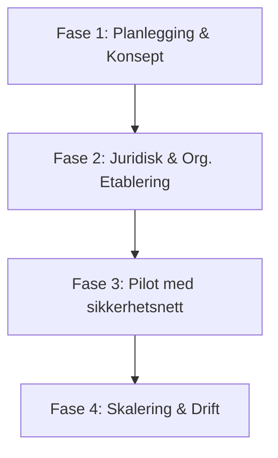

# Sammendrag av prosjektmodell og risiko — Syntax & Flow

Dette dokumentet gir en strukturert oversikt over **Syntax & Flow**-initiativet ved Høgskolen i Østfold (HiØ). Det fungerer som en sammenstilling av visjonen, driftsmodellen, de tre rekrutteringssporene, identifiserte juridiske risikoer (inkludert statsstøtte og arbeidstakerrisiko), samt de foreslåtte tiltakene og veikartet for etablering.

---

## 🎯 1. Konsept og visjon: "Studenten som produktet"

I motsetning til tradisjonell konsulentvirksomhet der man selger timer eller produkter, er **studenten selv det endelige produktet** i Syntax & Flow. 

Modellen skaper en vinn-vinn-vinn-situasjon:
*   **For studentene:** Mulighet til å tette erfaringsgapet etter endt utdanning gjennom reelt tverrfaglig samarbeid (IT, Design, Økonomi) i en trygg læringssone. Finansieres via Lånekassen eller NAV under et formelt praksisemne.
*   **For HiØ:** Økt kandidatproduksjon (flere fullførte grader) utløser direkte resultatbasert finansiering fra Kunnskapsdepartementet, samtidig som tilbudet fungerer som et sterkt rekrutteringskort for høgskolen.
*   **For næringslivet:** Mulighet til å evaluere potensielle fremtidige ansatte gjennom en praktisk, risikofri og kostnadsfri "test-run" på egne prosjekter.

Se mer i:
*   [README.md (root)](file:///Users/luffi/Library/Mobile%20Documents/com~apple~CloudDocs/Antigravity/Syntax&Flow/README.md)
*   [organisasjon_og_drift.md](file:///Users/luffi/Library/Mobile%20Documents/com~apple~CloudDocs/Antigravity/Syntax&Flow/01-administrasjon/organisasjon_og_drift.md)
*   [forretningsmodell.md](file:///Users/luffi/Library/Mobile%20Documents/com~apple~CloudDocs/Antigravity/Syntax&Flow/06-Business-case/Forretningsmodell/forretningsmodell.md)

---

## 👥 2. Deltakerordninger og rekrutteringsspor

Syntax & Flow baserer seg på tre alternative veier inn for deltakerne:

| Rekrutteringsspor | Studiepoeng | Finansiering | Omfang og tidsbruk | Målgruppe |
| :--- | :---: | :--- | :--- | :--- |
| **Spor 1: Fulltids Bedriftspraksis** | 30 stp/sem | Full basisstøtte fra Lånekassen | Fulltidsstilling (~37,5 timer/uke) | Nyutdannede bachelor- og masterkandidater ved HiØ. |
| **Spor 2: Enkeltemne i Bedriftspraksis** | 15 stp/sem | Gradert støtte fra Lånekassen | Deltid (~12,5–15 timer/uke) | Aktive studenter som tar emnet i kombinasjon med andre fag. |
| **Spor 3: Arbeidstrening via NAV** | N/A | Tiltakspenger, dagpenger eller lønnstilskudd fra NAV | Tilpasses individuell tiltaksplan (20% – 100% stilling) | Nyutdannede eller personer med IT/design/økonomibakgrunn som står utenfor arbeidsmarkedet. |

Se mer i:
*   [organisasjon_og_drift.md](file:///Users/luffi/Library/Mobile%20Documents/com~apple~CloudDocs/Antigravity/Syntax&Flow/01-administrasjon/organisasjon_og_drift.md)
*   [soknadsprosess_og_seleksjonskriterier.md](file:///Users/luffi/Library/Mobile%20Documents/com~apple~CloudDocs/Antigravity/Syntax&Flow/05-agent-forslag/Forslag/mal-og-utkast/soknadsprosess_og_seleksjonskriterier.md)

---

## ⚖️ 3. Juridiske barrierer og risikoanalyse

Etableringen av en slik modell møter fire sentrale rettslige utfordringer:

### A. Statsstøtterisiko (EØS-avtalen art. 61(1))
*   **Problemet:** HiØs bidrag (mentortimer fra forelesere, kontorlokaler og merkevare) er finansiert av staten. Når Syntax & Flow bruker dette til å tilby gratis eller rabatterte konsulenttjenester til næringslivskunder, kan dette anses som ulovlig statsstøtte. 
*   **Alvorlighet:** **Kritisk.** Eventuelle brudd kan føre til at ESA krever tilbakebetaling av fordelen med renter fra næringslivskundene, noe som kan føre til søksmål mot HiØ og Syntax & Flow.
*   **Se utdypende analyse:** [utdyping_statsstotte_eos.md](file:///Users/luffi/Library/Mobile%20Documents/com~apple~CloudDocs/Antigravity/Syntax&Flow/05-agent-forslag/motstand/utdyping_statsstotte_eos.md)

### B. Lånekassen-godkjenning
*   **Problemet:** Lånekassen krever at støttemottakere er reelle studenter med fremdrift. Et rent praksisår etter fullført grad uten tydelig utdanningsformål kan bli avvist. Dessuten må deltidsstudier være på minst 15 studiepoeng for å kvalifisere to gradert støtte.
*   **Alvorlighet:** **Kritisk.** Uten Lånekassen faller Spor 1 og 2 bort.
*   **Se utdypende analyse:** [juridisk_vurdering_og_risikoanalyse.md](file:///Users/luffi/Library/Mobile%20Documents/com~apple~CloudDocs/Antigravity/Syntax&Flow/05-agent-forslag/motstand/juridisk_vurdering_og_risikoanalyse.md)

### C. Arbeidstakerrisiko (Feilklassifisering)
*   **Problemet:** Dersom arbeidet studentene gjør i praksisen ligner for mye på et ordinært ansettelsesforhold (tette instrukser, faste oppmøtetider, resultatkrav fra kunder/mentorer), kan de rettslig bli ansett som arbeidstakere med krav på lønn og feriepenger.
*   **Alvorlighet:** **Høy.** Kan medføre store etterbetalingskrav og HMS-ansvar.

### D. Ansvarsforhold
*   **Problemet:** Skader eller økonomiske tap som følge av feil i levert kode, design eller økonomiske råd kan slå tilbake på studentene personlig dersom det ikke foreligger tilstrekkelige fraskrivelser og forsikringer.
*   **Alvorlighet:** **Høy.**

---

## 🛡️ 4. Strategiske og risikoreduserende tiltak

For å omgå de juridiske hindringene foreslås følgende tilpasninger:

1.  **Selskapsstruktur:** Stifte *Syntax & Flow AS* med 30 000 kr i aksjekapital, eid av en *ideell stiftelse*. HiØ skal ikke ha styreflertall, noe som skaper et tydelig juridisk skille mellom høgskolen og selskapet.
2.  **Akademisk forankring:** Utforme en formell [emnebeskrivelse](file:///Users/luffi/Library/Mobile%20Documents/com~apple~CloudDocs/Antigravity/Syntax&Flow/05-agent-forslag/Forslag/mal-og-utkast/emnebeskrivelse_bedriftspraksis.md) med faglige læringsmål, pensumlitteratur og vurderingsform (refleksjonsnotat og prosjektrapport). Dette forsvarer studentstatusen og kvalifiserer til Lånekassestøtte.
3.  **Avtaler til markedspris:** Syntax & Flow AS inngår en avtale med HiØ der forelesernes mentortimer og leie av kontorlokaler betales til markedspris (finansiert via eksterne innovasjonsmidler). Dermed faller elementet med "statlige midler" bort i statsstøttevurderingen.
4.  **Kunde- og støtteregister:** Føre et register over markedsverdi av leverte tjenester per kunde for å dokumentere at ingen overskrider *de minimis*-terskelen (300 000 EUR over 3 år).
5.  **Symbolsk prising / Rabatt:** Vurdere en modell der kunden faktureres en lav pris med dokumentert utdanningsrabatt (f.eks. 90-95% rabatt), slik at kunden bidrar økonomisk og seriøsiteten øker.
6.  **Betinget SLA og Ansvarsfraskrivelse:** Som hovedregel leveres prosjektene "som de er" uten leveransegaranti (Best-effort). En begrenset SLA tilbys kun dersom teamet har den nødvendige senior-kompetansen og prosjektet følges tett av mentor. Det signeres en tydelig ansvarsfraskrivelse med kunden, og selskapet tegner en profesjonell yrkesansvarsforsikring.

Se mer i:
*   [tilpasningsforslag_modell.md](file:///Users/luffi/Library/Mobile%20Documents/com~apple~CloudDocs/Antigravity/Syntax&Flow/05-agent-forslag/Forslag/tilpasningsforslag_modell.md)
*   [tjenester_og_leveranser.md](file:///Users/luffi/Library/Mobile%20Documents/com~apple~CloudDocs/Antigravity/Syntax&Flow/06-Business-case/Forretningsmodell/tjenester_og_leveranser.md)
*   [risiko_og_kostnadsanalyse.md](file:///Users/luffi/Library/Mobile%20Documents/com~apple~CloudDocs/Antigravity/Syntax&Flow/06-Business-case/Risiko/risiko_og_kostnadsanalyse.md)

---

## 📅 5. Veikart for etablering (4 faser)

Modellen etableres trinnvis for å minimere risikoen underveis:

*   **Fase 1: Planlegging (Måned 1–3):** Kartlegge eksisterende emner, identifisere interne HiØ-forkjempere, og knytte kontakter med lokale næringsforeninger.
*   **Fase 2: Juridisk og organisatorisk oppsett (Måned 3–6):** Stifte AS/stiftelse, innhente Lånekassen-forhåndsuttalelse, godkjenne emnet hos HiØ, tegne ansvarsforsikring, og signere samarbeidsavtale med HiØ til markedspris.
*   **Fase 3: Pilot (Måned 6–12):** Rekruttere et pilot-team (3–5 studenter) for én enkelt lokal kunde. Gjennomføre prosjektet under tett veiledning, dokumentere alt som bevis for ESA/Lånekassen, og evaluere grundig.
*   **Fase 4: Skalering (Måned 12–24):** Lansere digital portal/nettside med prosjektportefølje, åpne for automatisert søknad og de minimis-sporing for kunder, etablere en "defense pack" mot konkurranseklager, og forsiktig innføre NAV-sporet (Spor 3).

Se mer i:
*   [veikart.md](file:///Users/luffi/Library/Mobile%20Documents/com~apple~CloudDocs/Antigravity/Syntax&Flow/04-kilde/veikart.md)
*   [gjennomforingsplan_4_faser.md](file:///Users/luffi/Library/Mobile%20Documents/com~apple~CloudDocs/Antigravity/Syntax&Flow/05-agent-forslag/Forslag/gjennomforingsplan_4_faser.md)
*   [portal_og_nettsideplan.md](file:///Users/luffi/Library/Mobile%20Documents/com~apple~CloudDocs/Antigravity/Syntax&Flow/05-agent-forslag/Nettside/portal_og_nettsideplan.md)
